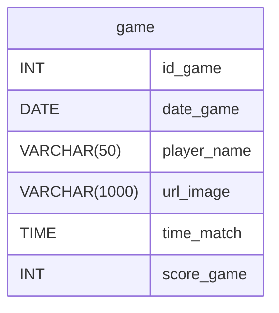

# Halloween Memory Card Game 🎃👻

Welcome to our Halloween-themed Memory Card Game, a spooky twist on the classic card-matching game! This game challenges players to match Halloween-themed cards, but beware: selecting the wrong cards might trigger some  jump scares.

## Project Overview

This project was developed using **HTML**, **CSS**, and **JavaScript** to create an interactive and visually memory game for the Halloween season.

### Features
- **Halloween-Themed Cards**: Each card contains a unique Halloween element, adding to the spooky atmosphere. 🎃
- **Jump Scares**: Selecting incorrect cards may trigger surprises, adding an extra thrill to the game. 👻
- **Random card shuffling**: The game automatically shuffles the cards sequence each time the page is reloaded. 🎴
- **Responsiveness**: Feel free to play on mobile devices! 📱

### How to Play
1. Click to flip two cards.
2. Match all pairs to win the game.
3. Beware of the spooky surprises if you flip the wrong cards!

### Unified Modeling Language Diagram

